<!-- Generated by `qits database diagram` (jpa). Do not edit: the entity-diagram automation rewrites this file on every release request fold. -->
# Persistence unit `artifacts`

Datasource `artifacts` · packages `eu.wohlben.qits.blobstore.entity`, `eu.wohlben.qits.artifacts.entity` · 17 entities

```mermaid
erDiagram
  %% artifact_metadata: eu.wohlben.qits.blobstore.entity.ArtifactRecord.metadata (qits-blobstore)
  artifact_metadata {
    string record_id PK, FK "not null"
    string meta_key PK "not null"
    string meta_value "length 4000"
  }
  %% artifact_record: eu.wohlben.qits.blobstore.entity.ArtifactRecord (qits-blobstore)
  artifact_record {
    string id PK "not null"
    instant accessed_at
    string blob_id "not null, length 64"
    instant created_at "not null"
    string mediatype "not null"
    string repository "not null"
    long size_bytes "not null"
  }
  %% artifact_repository: eu.wohlben.qits.blobstore.entity.ArtifactRepository (qits-blobstore)
  artifact_repository {
    string name PK "not null"
    instant created_at "not null"
    string type "not null"
  }
  %% content_hash: eu.wohlben.qits.artifacts.entity.ContentHash (artifacts)
  content_hash {
    string ecosystem PK "not null, length 8"
    string package_name PK "not null, length 512"
    string repository PK "not null"
    string version PK "not null, length 128"
    instant created_at "not null"
    string value "not null, length 160"
  }
  %% daemon_binary: eu.wohlben.qits.artifacts.entity.DaemonBinary (artifacts)
  daemon_binary {
    string name PK "not null"
    string repository PK "not null"
    string version PK "not null, length 128"
    instant accessed_at
    string blob_id "not null, length 64"
    instant published_at "not null"
    long size_bytes "not null"
  }
  %% docs_file: eu.wohlben.qits.artifacts.entity.DocsFile (artifacts)
  docs_file {
    string name PK "not null"
    string path PK "not null, length 1024"
    string repository PK "not null"
    string version PK "not null, length 128"
    string blob_id "not null, length 64"
    string media_type "not null, length 128"
    long size_bytes "not null"
  }
  %% docs_site: eu.wohlben.qits.artifacts.entity.DocsSite (artifacts)
  docs_site {
    string name PK "not null"
    string repository PK "not null"
    string version PK "not null, length 128"
    instant accessed_at
    int file_count "not null"
    instant published_at "not null"
    long total_bytes "not null"
  }
  %% docs_site_metadata: eu.wohlben.qits.artifacts.entity.DocsSite.metadata (artifacts)
  docs_site_metadata {
    string name PK, FK "not null"
    string repository PK, FK "not null"
    string version PK, FK "not null, length 128"
    string meta_key PK "not null"
    string meta_value "length 4000"
  }
  %% maven_artifact: eu.wohlben.qits.artifacts.entity.MavenArtifact (qits-registries-maven)
  maven_artifact {
    string path PK "not null, length 1024"
    string repository PK "not null"
    instant accessed_at
    string blob_id "not null, length 64"
    instant created_at "not null"
    long size_bytes "not null"
  }
  %% maven_proxy_metadata: eu.wohlben.qits.artifacts.entity.MavenProxyMetadata (qits-registries-maven)
  maven_proxy_metadata {
    string path PK "not null, length 1024"
    string repository PK "not null"
    text doc "not null"
    string etag
    instant fetched_at "not null"
    string last_modified
  }
  %% npm_dist_tag: eu.wohlben.qits.artifacts.entity.NpmDistTag (qits-registries-npm)
  npm_dist_tag {
    string package_name PK "not null"
    string repository PK "not null"
    string tag PK "not null, length 128"
    instant updated_at "not null"
    string version "not null, length 128"
  }
  %% npm_proxy_packument: eu.wohlben.qits.artifacts.entity.NpmProxyPackument (qits-registries-npm)
  npm_proxy_packument {
    string package_name PK "not null"
    string repository PK "not null"
    text doc "not null"
    string etag
    instant fetched_at "not null"
  }
  %% npm_version: eu.wohlben.qits.artifacts.entity.NpmVersion (qits-registries-npm)
  npm_version {
    string package_name PK "not null"
    string repository PK "not null"
    string version PK "not null, length 128"
    instant accessed_at
    instant created_at "not null"
    string integrity
    text manifest_json "not null"
    string shasum
    string tarball_blob_id "not null, length 64"
  }
  %% npm_version_tombstone: eu.wohlben.qits.artifacts.entity.NpmVersionTombstone (qits-registries-npm)
  npm_version_tombstone {
    string package_name PK "not null"
    string repository PK "not null"
    string version PK "not null, length 128"
    instant collected_at "not null"
    string tarball_blob_id "length 64"
  }
  %% oci_manifest: eu.wohlben.qits.artifacts.entity.OciManifest (qits-registries-oci)
  oci_manifest {
    string digest PK "not null, length 64"
    string image_name PK "not null"
    string repository PK "not null"
    instant accessed_at
    instant created_at "not null"
    string media_type "not null"
    long size_bytes "not null"
  }
  %% oci_mirror_tag_check: eu.wohlben.qits.artifacts.entity.OciMirrorTagCheck (qits-registries-oci)
  oci_mirror_tag_check {
    string image_name PK "not null"
    string repository PK "not null"
    string tag PK "not null, length 128"
    instant checked_at "not null"
  }
  %% oci_mirror_upstream: eu.wohlben.qits.artifacts.entity.OciMirrorUpstream (qits-registries-oci)
  oci_mirror_upstream {
    string domain PK "not null"
    instant created_at "not null"
    string slug UK "not null"
  }
  %% oci_tag: eu.wohlben.qits.artifacts.entity.OciTag (qits-registries-oci)
  oci_tag {
    string image_name PK "not null"
    string repository PK "not null"
    string tag PK "not null, length 128"
    instant accessed_at
    string manifest_digest "not null, length 64"
    instant updated_at "not null"
  }
  %% sbom_document: eu.wohlben.qits.artifacts.entity.SbomDocument (artifacts)
  sbom_document {
    string package_name PK "not null, length 512"
    string package_type PK "not null, length 16"
    string repository PK "not null"
    string version PK "not null, length 128"
    instant accessed_at
    string blob_id "not null, length 64"
    instant created_at "not null"
    long size_bytes "not null"
    string spec_version "not null, length 8"
  }
  artifact_metadata }o--|| artifact_record : "record_id"
  docs_site_metadata }o--|| docs_site : "name, repository, version"
```

